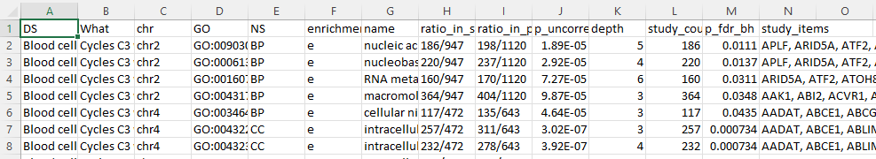

# About GOEA results
These results were generated using the [GOEA\runGOEA.py](GOEA\runGOEA.py) script, but using data of all chromosomes.

Results are generated using https://github.com/tanghaibao/goatools/tree/main library. For full definition of results, read the documentation of the goatools library. But here is the brief overview of result files:
- column A: dataset name; Either original or randomized.
- column B: object analyzed. E.g.Cycles C3 w/ 1+ tissue vs Links w/ 1+ tissue means that the study genes were taken as genes of links of C3 cycles (cliques) with at least 1 tissue; population genes were taken from links with at least one tissue;
- column E: type of GO. BP for Biological Process; MF for Molecular Function; CC for cellular Component;
- column F: e for enriched; p for purified. Enriched means there are significantly more of this term in study gene set, compared to the population gene set.
- column M: pvalues < 0.05 corrected using Benjamini-Hochberg multiple test correction
- column J: uncorrected pvalues for a test whether a particular GO term is significantly enriched
- column N: list of genes with a particular GO term.

